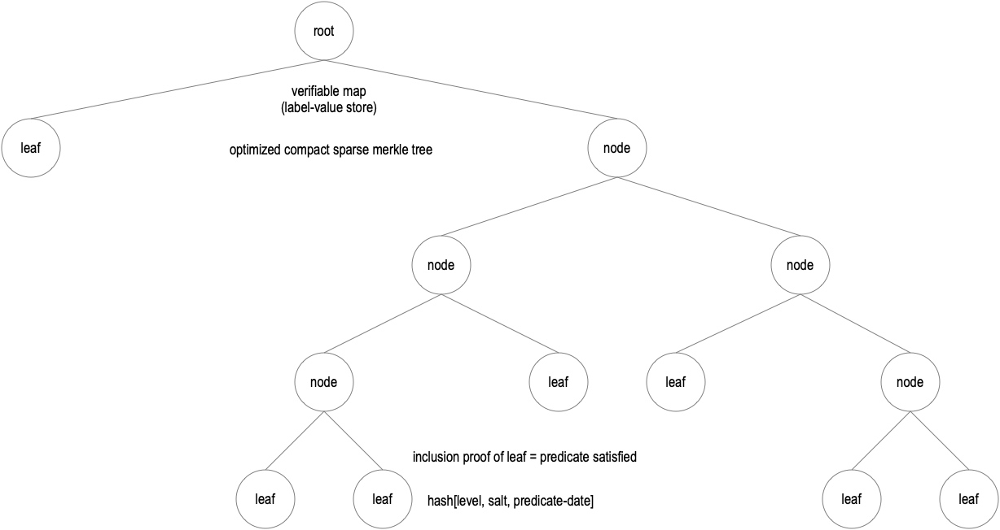

# ACDC with Static Age Predicate Proof SMT

Version 1.6  2025/10/28

## Motivation

The primary problem is to select an ACDC-compatible mechanism that provides proof of age without disclosing the actual birthdate or leaking information that can be correlated to infer it. The primary technical difficulty is that a given individual's age changes over time. Therefore, a static a priori issuance of a given proof of age could become invalid as the individual's age changes. 

One way to address the age-change dynamism is to use a blindable ACDC state registry to verify age.  Blindable placeholder updates can be used to decorrelate updates to the registry from actual age changes. The main drawback of this approach is that it may require a relatively large number of updates to the proof-of-age ACDC's blindable state registry throughout a given individual's lifespan. 

Another alternative would be to use a ZKP predicate proof. One of the useful features of some ZKP signature systems is that one can construct a ZKP circuit that allows one to prove a predicate, such as one number greater than or equal to another number, but without disclosing that other number. In the case of a proof of age, the other number is the birthdate, and the predicate is evaluated with respect to the time span between the current date and the birthdate.  Indeed, predicate proofs are among the most compelling reasons to consider ZKPs over other alternatives.  

The problem with the available (adoptable) ZKP systems that support predicate proofs is that they also have the property of unlinkability. In this case, the Issuer of the credential is unable, by virtue of that unlinkability, to detect that a credential has been fraudulently issued as a result of a compromise of the Issuer's signing infrastructure. Detection requires that the Issuer collude with or cooperate with the verifier and/or holder, which cooperation breaks unlinkability.  In general, the use of unlinkable ZKPs is therefore precluded to preserve the detectability of an Issuer signing infrastructure compromise as one of the inviolable properties of KERI/ACDCs. The inability of an Issuer to detect key compromise enables fraudulent issuance of ACDCs.

Likewise, the key compromise of an Issuee (Holder) can be made detectable using a presentation registry. Which would also be defeated by an unlinkable ZKP. Thus, a given Issuee (Holder) wallet could be impersonated and used to present fraudulent proofs of age.

Nevertheless, one might be able to construct a ZKP that enables linkability while still benefiting from dynamic predicate proofs, but the existing open-source ZKP libraries do not support this functionality. Indeed, the most highly touted salient feature of ZKPs is their unlinkability.  

To elaborate, because, by design, ZKP unlinkability undermines KERI's detectability property, which is needed to guarantee recoverability from compromise, ZKPs are not a viable solution to the proof-of-age problem with KERI/ACDC-based proof-of-age entitlements.  

The purpose of this paper is to describe in detail a non-dynamic but practical alternative that preserves KERI's detectability property. This practical alternative is based on a sparse Merkle tree (SMT) that can be preconfigured to provide predicate proofs for all the anticipated predicates. The issued ACDC includes an attribute that is the Root of the SMT. This makes a verifiable commitment to all leaves in the SMT. In the event that other predicates become necessary in the future, after the initial issuance, the verifiable map SMT can be dynamically augmented with these additional leaf predicate values. In this case, the Issuer creates an augmented SMT and issues a new ACDC that includes the root digest of the augmented ACDC. A proof of the original SMT's inclusion in the new SMT can be created. This approach provides a reasonable trade-off: limited dynamism with strong security (detectability of key compromise for both the Issuer and the Issuee) that protects against fraudulent proof-of-age Issuances and Presentations.

By way of comparison, ZKP predicate proofs require relatively small storage but relatively large computation, whereas SMT predicate proofs require relatively large storage but relatively small computation.

In either approach—dynamic ZKP predicate or static SMT predicate—the storage/computation requirements are not prohibitive. They are both within reason for a mobile phone device. Therefore, the determinative feature is that a static SMT predicate proof preserves KERI's security properties, whereas a dynamic ZKP predicate proof defeats it. Furthermore, a predicate SMT does not require the frequent registry updates required by a dynamic, blindable state registry. Consequently, the overall preferred alternative is an SMT predicate proof.

## Optimized Compact Sparse Merkle Trees

A sparse Merkle tree (SMT) is a special type of binary tree that can be used as a verifiable key-value store called a verifiable map.  Each leaf node provides a key. The key is computed as the cryptographic digest (hash) of the data value stored at or referenced by that leaf node. Each non-leaf node value is the optimized digest hash of the node digests attached to it. The root node of the tree is called the root digest or Merkle root. Because each node in the tree is a cryptographic digest of its attached branches, the tree is tamper-evident. Any change to any branch or leaf at the end of any branch changes the digest values of the nodes on that branch and hence the root digest of the whole tree. 

A useful feature of an SMT is that one can provide a proof-of-inclusion of a given leaf in that SMT without disclosing all the leaves in the SMT. Indeed, a proof of inclusion only requires disclosing the nodes along the branch to that leaf.  The number of nodes on a branch of a binary tree is proportional to logN, where N is the number of leaves in the tree. Computing the hashes along the disclosed branch enables verification that the SMT MUST include the leaf. Optimized compact sparse Merkle trees have the property that the number of operations for inclusion proofs, exclusion proofs, leaf additions, and leaf subtractions is all proportional to logN. This makes them very performant even for very large N. 

The Merkle tree needs appropriate protection against second-preimage attacks on interior branch nodes [[50]] [[51]]. This may be achieved by including the node's level in the information digested for that node. Optimized SMTs collapse empty branches (unoccupied leaves) so that the number of nodes is proportional to the number of occupied leaves. The total number of nodes, M, including leaves, in a compact sparse Merkle tree (SMT) is proportional to 2N, where N is the number of leaf nodes. We represent this as M = O(2N) or M ∝ 2N

To elaborate, the vast majority of branches in a compact SMT are empty and collapse, thereby minimizing the total number of nodes in the tree. This is shown in the following diagram. 

The following references provide some detail on the operation of SMTs.  The Trillian-Tessera project provides well-supported open source code libraries for the SMT used by the Certificate Transparency project. This is used at scale by all the major browser vendors and web content delivery networks.

[Merkle Tree](https://en.wikipedia.org/wiki/Merkle_tree), [Second Pre-image Attack on Merkle Trees](https://flawed.net.nz/2018/02/21/attacking-merkle-trees-with-a-second-preimage-attack/), [Merkle Tree Security](https://blog.enuma.io/update/2019/06/10/merkle-trees-not-that-simple.html), [Optimized Sparse Merkle Tree](https://ouvrard-pierre-alain.medium.com/optimized-sparse-merkle-tree-fb481875d56e), [Verifiable Data Structures, Sparse Merkle Tree](https://github.com/google/trillian/blob/master/docs/papers/VerifiableDataStructures.pdf), [Certificate Transparency, Append Only Logs](https://www.researchgate.net/publication/274056469_Certificate_Transparency), [IETF RFC-9162, Certificate Transparency](https://datatracker.ietf.org/doc/rfc9162/), [Certificate Transparency Community](https://certificate.transparency.dev/community/), [Trillion Sparse Merkle Tree](https://github.com/google/trillian?tab=readme-ov-file), [Trillian Tessera, Tiled Transparency Logs](https://github.com/transparency-dev/tessera), [Efficient Sparse Merkle Tree](https://eprint.iacr.org/2016/683.pdf), [Optimized Compact Sparse Merkle Tree](https://github.com/nervosnetwork/sparse-merkle-tree/blob/master/SMT.md)

## Static Age Predicate Construction

A reasonable age resolution for a proof of age predicate is one day. An individual's age is computed relative to a 24-hour period beginning at midnight or `00:00` of a given day.  Suppose the individual's birthdate is `2025/10/20`.  That individual will be considered to be 1 year old at exactly `00:00` on `2026/10/20`.
A given date is encoded as the eight-character concatenated string of year, month, and date as follows: `20251020`. 
The minimum age for any predicate is 0 years.
Predicates that are greater than a given yearly age require a maximum age. Let that be 100 years. This assumes there is no predicate that requires an age greater than 100. Using a higher maximum, like 120 years, will not materially affect the size or performance.  However, for simplicity in this construction, 100 is used as the maximum.

A predicate value is created by concatenating the predicate consisting of the predicate operator and the year value for a given date, upon which that predicate is true. For example, if the predicate is `>=13` for the birthdate `20251020`, then the predicate would be true for any date on or after `20381020`. For the date, `20381020`, this is encoded as `20381020>=13`. This is used to form a leaf in the SMT. Likewise, for the date, `20381021`, this is encoded as `20381021>=13`. This also used to form a leaf in the SMT. A leaf predicate is computed for every date up to the maximum age of 100. In this case, `21251020`. A proof-of-age is given by an inclusion proof of a given predicate leaf in the SMT. When no such leaf exists, then a proof-of-age is not possible.

In addition to the date predicate values created above, each leaf may benefit from a blinding factor. The blinding factor protects leaf values against a 3rd-party rainbow-table attack in which the attacker queries the SMT for inclusion proofs of a sequence of leaf predicates that enable it to walk back to the earliest true predicate and thereby deduce the birthdate. With a blinding factor, however, only 2nd parties to a disclosure can construct a valid query of the SMT. The blinding factor is typically a salty nonce. To elaborate, the blinding factor is only disclosed to the Disclosee (Verifier) at the time of disclosure by the Issuee (Holder) of a given proof-of-age presentation. This enables only the Disclosee (Verifier) of a given presentation to construct a valid leaf-node inclusion proof query for the SMT, not any 3rd party. Without access to the blinding factor, it becomes computationally infeasible for a third party to infer valid age predicate values by repeatedly querying the tree.

To create the blinding factor, the Issuer and Issuee exchange a shared secret salt at the time of issuance. Each leaf's blinding factor is then generated using a hierarchical-deterministic algorithm that hashes the salt concatenated with the date-predicate string. 

`blind = H[salt, '20381020>=13']`
 
Moreover, because a given branch in a hash tree may be constructed in different ways but have the same hash at the top of the branch, other values, such as a node's level in the tree (branch), must be included in the digested value for each node. We call the set of these bookkeeping values simply the node index. A node index is SMT algorithm-specific.

The final leaf node digest is computed over the concatenation of the date-predicate string, the blinding factor, and the node index for the particular SMT algorithm. In simple form for the example predicate `>=13` the leaf digest  is given by:

`leaf = H['20381020>=13', blind, level]`

This is the leaf node digest (key). This is added to the SMT. To fully populate the SMT for this predicate, a leaf node predicate value is computed for every date that satisfies the predicate.

In general, predicates that are `>` or `>=` an age require a leaf for every date where the predicate is true up to the maximum age of 100, and predicates that are `<` or `<=` require a leaf for every date where the predicate is true down to the date of issuance.

The number of leaves and the size of the SMT for the `>=13` age predicate can be estimated as follows:

Each digest MUST have 128 bits of cryptographic strength. For digest algorithms such as SHA2, SHA3, Blake2, and Blake3, this requires a 256-bit digest (32 bytes).

Birthdate: 20251020
Issuance Date: 20251020  (issued on date of birth)
First Date where predicate is true: 20381020
Maximum Age: 100
Number of leaves: (100 - 13 = 87) years * 365 days  = 31,755
Number of bytes for leave nodes: 32 * 31,755 = 1,016,160 bytes ≈ 1 MiB ≈ 1 MB
Number of Nodes in Tree: M = 2N = 2 * 31,755 = 63,510
Total Size of Tree: 63,510 * 32 = 2,032,320 bytes ≈ 2 MiB ≈ 2 MB
Proof of Inclusion:  O(log N) where N is 31,755, Log2(31,755) ≈ 15 operations

The total size of the SMT is no more than the average size of a digital photo.

## Full Suite of Age Predicates

A single predicate is not very useful when the predicate is static. So, at the very least, we want to include SMT predicates for all legal-age requirements. The full set of legal age predicates is defined by statute. In the state of Utah, these include: `>=5` for kindergarten, `>=6` for first grade, `>=13` for social media, `>=14` for employment, `>=15.5` for learner's permit, `>=16` for driving, `>=18` for voting, and `>=21` for drinking. For retirement, there are three tiers: `>=60`, `>=62`, and `>=65`.  Assuming we didn't miss any, the total number of predicates listed above is 11. 

Another useful set of predicates is for child participation in competitive sports. These predicates are usually expressed as under or less than a given age. For example, `<6`. There may be a predicate for every age up to 18. So a total of 12 predicates.

For senior sports, the predicates are based on age, such as `>=40`, `>=50`, `>=55`, `>=60`, `>=65`, and `>=100`. Some of these are duplicates of the retirement ages. So another 4 predicates.

Let's suppose we start with these three sets of predicates, totaling 27. Let's round up to a total of 30.

The worst-case predicate has 100 * 365 = 36,500 leaves, for a worst-case size of 2 * 36,500 * 32 = 2,336,000, or about 2 MB. So the worst-case total size of the SMT with 30 predicates is going to be about 60 MB. This is about the size of a one-minute MPEG video. The actual size will be much less because the `<` predicates only need a fraction of 100 years.

Let's go even further, suppose we want two predicates, `<` and `>=`, for every age from 1 to 100, for a total of 200 predicates. This would allow proof of any age range, providing essentially the same flexibility as a dynamic ZKP predicate range proof for any daily resolution of a yearly age. The minimum number of years of leaf node predicates of 365 predicates per year is 1 year of leaf nodes, and the maximum is 100 years of leaf nodes. Therefore, the average number of years of leaf nodes per predicate is 50 for an equivalent total of 50 years of leaf nodes per `<` predicate + 50 years of leaf nodes per `<=` predicate. The size of this SMT can be calculated as about 200 predicates * 50 years of leaf nodes per predicate * 365 daily predicate leaf nodes per year * 2 nodes per leaf * 32 bytes = 233,600,000 bytes = 233.6 MB = 222.78 MiB. This is equivalent to a single five-minute MPEG video. This is a worst-case. 

The total number of leaves in this SMT is about N = 2 * 200 * 50 * 365 = 7,300,000. The number of operations required to provide a single predicate proof is O(log N) = log2(7,300,000) ≈ 23. A range proof requires two predicate proofs for a total of 46 hashing operations. This is a tiny fraction of the computing power required to generate a ZKP circuit for a predicate range proof. So SMT proofs will be really, really fast compared to ZKP proofs. A time to generate a given ZKP predicate proof is usually estimated at around 1 second. Multiple ZKP proofs would become annoyingly long, whereas a storage requirement of 200 MB is unlikely to be problematic for late-model mobile devices that have at least 128 GB of storage and usually 256 GB or more. For example, 233 MB is less than 1/10 of a percent of the storage on a 256 GB mobile phone (233 MB / 256 GB = 0.00091).

## Usage

To reiterate, a universal static age predicate SMT is stored on the mobile device holding the Issuee (Holder) wallet. This is likely to have a worst-case size of around 200 MB. This supports range predicates for all combinations of ranges from yearly ages 0 - 100. This is transmitted only once, at the issuance of the proof-of-age ACDC to the Issuee (Holder). A proof of age for a given predicate takes about 24 operations. A proof of age for a given range takes twice that, or 48 operations. So very, very fast when compared to a ZKP predicate range proof. Moreover, compared to ZKPs, the SMT predicate approach supports the anti-fraud protection derived from the strong detectability properties of key compromise with anchored KERI/ACDCs for Issuers and anchored presentations for Issuees.

## Social Engineering Attacks

Regardless of what mechanism a predicate proof-of-age uses, one way to defeat the hiding properties of a predicate proof is to induce the Holder to attempt a proof slightly before the predicate is true and then again slightly after. This enables the attacker to infer the actual birthday as X years (the age predicate) from the date range between the two proof attempts.

For the predicate `>=13`, when a child first becomes old enough to participate in social media, such social media companies will, with high likelihood, be able to deduce the birthdate, as such youth will be highly incentivized to log on to the website either on their birthday or within a day or two of their birthday when they first meet the age requirement. These types of socially engineered attacks mean that for the vast majority of users, the hiding properties of predicate age proofs will likely be easily defeated.

